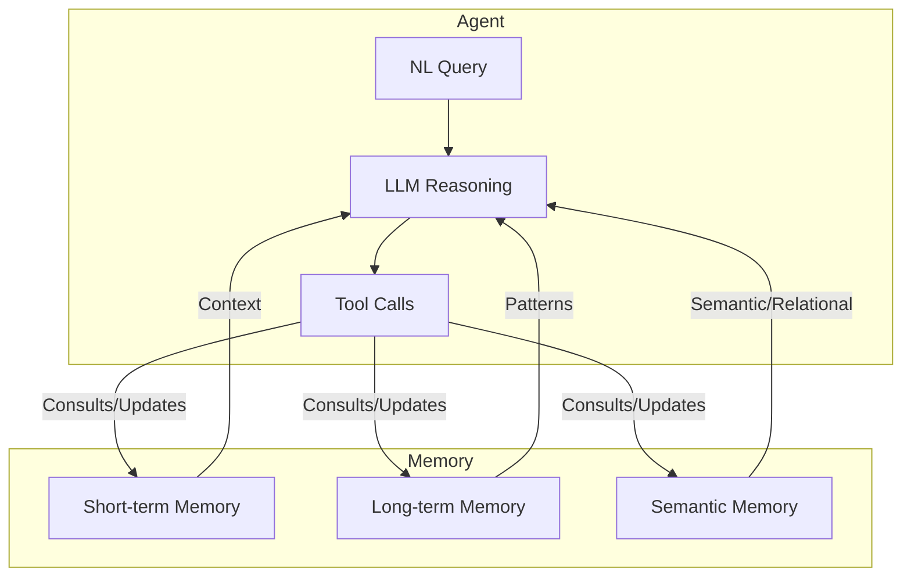

# Memory-Based Retrieval Architecture

## Overview
This document describes the architecture for integrating short-term, long-term, and semantic memory into an agentic NL2SQL retrieval system. The goal is to enable efficient, context-aware, and reasoning-capable query translation, especially for large and complex schemas.

---

## Memory Types

### 1. Short-term (Session) Memory
- **Scope:** Current session/conversation.
- **Stores:**
  - Recent tool calls and results
  - User clarifications
  - Explored schema elements
  - Intermediate reasoning steps
- **Purpose:**
  - Supports follow-up queries and session continuity
  - Avoids redundant clarifications and schema exploration

### 2. Long-term (Agentic) Memory
- **Scope:** Persistent across sessions and users.
- **Stores:**
  - Common join paths and schema insights
  - User preferences and query patterns
  - Schema evolution (deprecated/new tables)
- **Purpose:**
  - Personalization and adaptation
  - Faster, smarter retrieval for recurring patterns

### 3. Semantic/Relational Memory
- **Scope:** Knowledge graph or vector store of semantic relationships.
- **Stores:**
  - Synonym mappings (e.g., users = customers)
  - Reasoning chains (e.g., region = ca_state)
  - Multi-hop join paths
- **Purpose:**
  - Disambiguation and robust retrieval
  - Supports semantic and relational reasoning

---

## Architecture Diagram

---

## Memory Flow
1. **Agent receives NL query.**
2. **LLM consults all memory types:**
   - Short-term: What has been explored/clarified in this session?
   - Long-term: What are common join paths, user preferences?
   - Semantic: What synonyms or reasoning chains are relevant?
3. **Agent makes tool calls, updates memory after each step.**
4. **For follow-up queries:**
   - Short-term memory provides immediate context.
   - Long-term and semantic memory bias retrieval and reasoning.

---

## Example Use Cases
- **Follow-up Query:**
  - User: "Now show only the top 3 products for California."
  - Agent: Uses short-term memory to recall previous region/product context.
- **Ambiguous Term:**
  - User: "Show sales by area."
  - Agent: Uses semantic memory to map 'area' to 'region' (ca_state).
- **Recurring Pattern:**
  - User: "Show sales by region."
  - Agent: Uses long-term memory to recall that 'region' = 'ca_state' is common for this org.

---

## Integration Points
- Memory modules are consulted before tool calls and LLM prompts.
- Memory is updated after each reasoning/tool step.
- Memory can be persisted (long-term), session-based (short-term), or embedded/graph-based (semantic). 